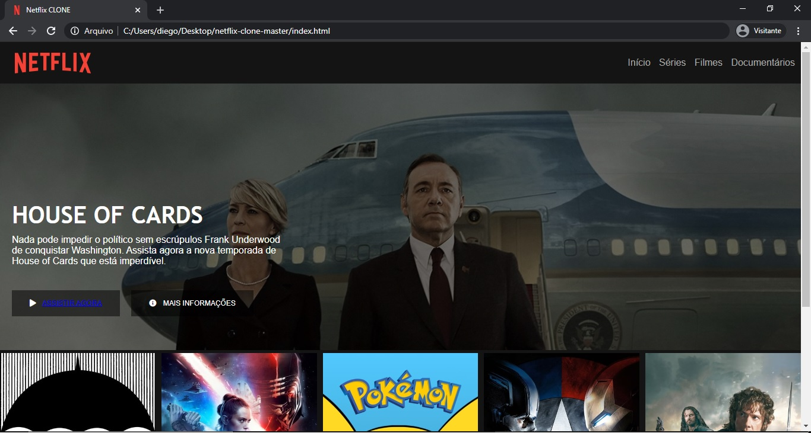

<h2 align="center">Projeto: Netflix-Clone</h2
​    

## 🚀 Projeto

Projeto feito durante o Bootcamps "HTML Web Developer" da Digital Innovation One

## 🛠 Linguagens:

* HTML
* CSS
* JavaScript

## 🛠 Ferramenta:

* Sublime 3

##  💻Visualização:

 Caso deseje ver as mudanças, assista o vídeo abaixo.

<a href="https://www.youtube.com/watch?v=4nrLEHufU1Y" target="_blank">Clique aqui</a>

##  ✔Atualização:
24/01 - Atualização: Inserção do ícone da netflix, mudança do logo para mais perto do logo original, inserção da janela modal, para inserção de link´s redirecionando cada imagem para seus pespectivos trailers e, ao clicar no novo logo inserido, o usuário é redirecionado direto para a página oficial do netflix.

---

<h3>
Developed by <strong>DSB🐱‍👤</strong>
<h3>
